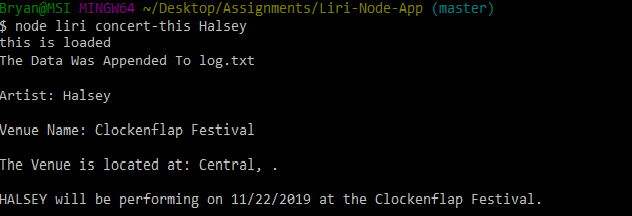
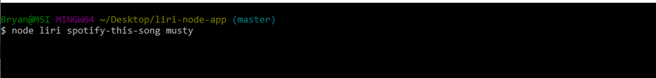
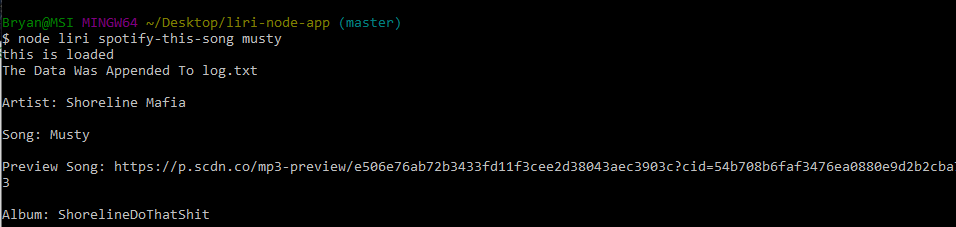
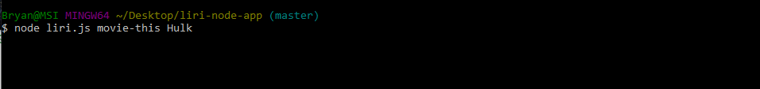
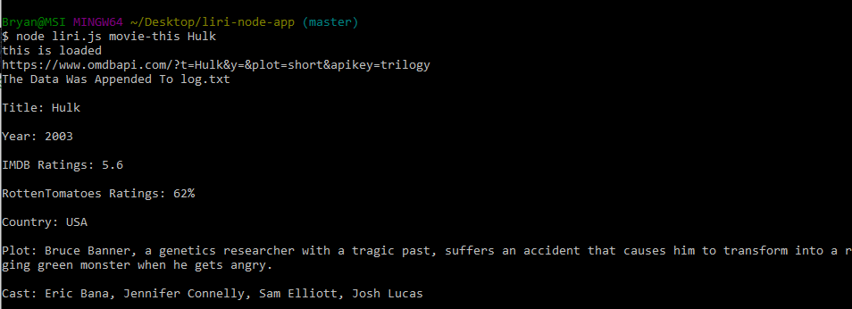
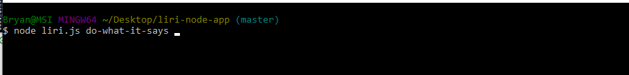
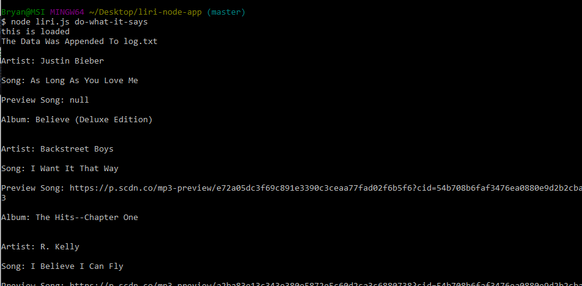

# Liri-Node-App

### Links: 

Github: <br>
https://github.com/bryanjacinto1994/Liri-Node-App

<hr>

## Tools Used:

* Visual Studio Code - Open source code editor for building and debugging web and cloud applications.
* JavaScript - A scripting language that uses curly-bracket syntax, first class functions and object-oriented.
* jQuery - A JavaScript library that simplifys to manipulate HTML DOM.
* Git - Version control system to track changes to source code.
* Github - Hosts respository that can be deployed to GitHub pages.
<br>

### NPM Packages Used:
* MomentJS
* Axios
* File System
* Spotify 
* Dotenv


<hr>

## Summary

Using JavaScript and all the NPM packages listed above via Visual Studio Code, a "Language Interpretation and Recognition Interface" or LIRI for short, was created. 

For the NPM Packages (listed above), this was used to have access to get request from servers API in order to get the results using "axios.get()" function. In order to have access for that, I installed the npm onto the Terminal/Git Bash using the input "npm install axios". <br>
The installation for the other npm packages are the same way:<br>
* #### MomentJS: <br><br>$ npm install moment --save
* #### Axios:<br><br> $ npm install axios
* #### File System: <br><br>$ npm install file-system --save
* #### Spotify:<br><br> $ npm install --save node-spotify-api
* #### Dotenv:<br><br> $ npm install dotenv

<br>

After installing all these required npm packages, I created a value of each of these packages and stored them in variables using "require()".
```javascript
//Reads and sets any evironment variables with the 'dotenv' package
require("dotenv").config();

//============================= [Spotify Keys] =============================//
//A variable that imports the keys.js file
var keys = require("./keys.js");
var Spotify = require('node-spotify-api');
//Access the keys information with spotify
var spotify = new Spotify(keys.spotify);
var fs = require("fs");

//============================= [NPM Packages] =============================//
//Include axios npm package
var axios = require("axios");
//Include moment npm package
var moment = require('moment');
```
Then I made a switch function that has four different actions/commands that will be used to get the results that was requested. Each actions does different functions:<br><br>
* #### concert-this: <br>Searches for an artist and lets the user know when and where that artist's next event are.<br><br>
##### concert-this input:
<br>
##### concert-this output:
<br>
* #### spotify-this:<br> Seaches for a song and returns an output lists of artist name, song, the preview url of the song (30 seconds preview), and lastly, the artist's album name.<br><br>
##### spotify-this-song input:
<br>
##### spotify-this-song output:
<br>
* #### movie-this: <br>Searches for a movie and returns an output lists of movie title, year of the movie produced, the ratings for IMDB and RottenTomatoes, the country of where the movie was made and published, the plot summary of the movie, and the main-cast who played specific roles.<br><br>
##### movie-this input:
<br>
##### movie-this output:
<br>
* #### do-what-it-says:<br> Calling out this function will return you the output of what is in the "random.txt" file. The spotify function is called out within do-what-it-says function so whenever this function is called on the Terminal/Git Bash, it gives the user the name of the song, the artists, preview url of the song (30 seconds preview), and the album name.
##### do-what-it-says input:
<br>
##### do-what-it-says output:
<br>
<hr>

## Code Snippet

liri.js : <br> Switch function allows the user to type the case name that is specified to each different functions. By inputting "node liri.js casename" (Example: node liri.js concert-this "artist name"), the output gives you the results such as the name of the artist, when the artist's next event and the location of the event. You can also choose other cases to search up movies and songs. 
```javascript
switch (action) {

    case "concert-this":
        concertLiri(search);
        break;

    case "spotify-this-song":
        spotifyLiri(search);
        break;

    case "movie-this":
        omdbLiri(search);
        break;

    case "do-what-it-says":
        doWhatItSaysLiri();
        break;
}
```
liri.js:<br>
This is a snippet of the "spotify-this-song" command. There is a statement made "(!search)" if there is no song input, it will give the default song, "The Sign, Ace of Base", automatically. <br><br>
A spotify.search function was created to get the song that was searched by inputting "node liri.js spotify-this-song "song/artist name" on the Terminal/Git Bash.
```javascript
//If there is no search inputed in the Terminal/Git Bash, this function will automatically search up the default song.
    if(!search){
        search = "The Sign, Ace of Base";        
    }

    //This function searches for a song, artist, or track. *Google [node-spotify-api] for examples*
    spotify.search({ type: 'track', query: search })
        .then(function (response) {

           //This holds the Artist name
            console.log("\nArtist: " + response.tracks.items[0].artists[0].name + "\n");
            //This holds the Song name
            console.log("Song: " + response.tracks.items[0].name + "\n");
            //This holds the Preview link
            console.log("Preview Song: " + response.tracks.items[0].preview_url + "\n");
            //This holds the Album name
            console.log("Album: " + response.tracks.items[0].album.name + "\n");
        })
```


liri.js:<br>
fs.appendfile appends (or add on) the data input to the log.txt file. whe

```javascript
fs.appendFile("log.txt", action + ', ', function(err){
    if (err) throw err;
    console.log("The Data Was Appended To log.txt");
})
```


## Author Links
Linkedin:<br>
https://www.linkedin.com/in/bryan-jacinto-100438aa/

Github:<br>
https://github.com/bryanjacinto1994
